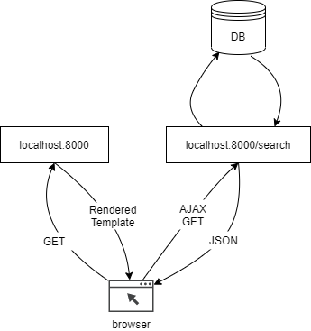

# Lab 6: Library

Let's build a single page application for managing a library of books.

## Part 1

Define the following model, and load the data from [books.json](./books.json) into your database using a custom management command. Either download the file and load it using `open` or use `requests` to send a `get` request to the url for the raw json.

- Book
  - title (`CharField`)
  - author (`CharField`)
  - image (`CharField`)
  - year (`IntegerField`)
  - pages (`IntegerField`)
  - url (`IntegerField`)
  - country (`CharField`)
  - language (`CharField`)

## Part 2

Set up a `search` view accessed by `localhost:8000` that takes two query parameters, `search` and `page`. The view should return `json` containing books that match the search text (if blank or missing, return all books) and page number (5 books per page, use the django paginator).

For example, accessing `localhost:8000/search?text=chaucer&page=1` should return something like:

```json
{
    "books": [
        {
            "title": "The Canterbury Tales",
            "author": "Geoffrey Chaucer",
            "imageLink": "images/the-canterbury-tales.jpg",
            "link": "https://en.wikipedia.org/wiki/The_Canterbury_Tales",
            "country": "England",
            "language": "English",
            "year": 1450
            "pages": 544,
        }
    ]
}
```

## Part 3

Create an `index` view that returns a template containing a Vue app. The Vue app should have a `books` array in its `data` and send an ajax `GET` request from the app's `created` lifecycle hook. It should then show the books in the page. Allow the user to enter text and change the page number to get different results. You can show the image for each book by concatenating them with the url to the image, e.g. `https://raw.githubusercontent.com/PdxCodeGuild/class_mountain_goat/master/4%20Django/labs/images/<image>.jpg`



## Part 4 (optional)

Add an additional `BooleanField` called `favorited` to the `Book` model. Add two additional views:

- `toggle_favorite` takes a `book_id` as a query parameter and sets the `favorite` field on the given book to `True` if it's `False` or `False` if it's `True`.
- `favorites` returns all books for which `favorite` is `True` in `json`.

Add a `favorite` button next to each book which sends a request `toggle_favorite` and changes the display to indicate whether it's been favorited. Add a part of your page to show all the favorited books (either a separate list or as part of the search controls).

